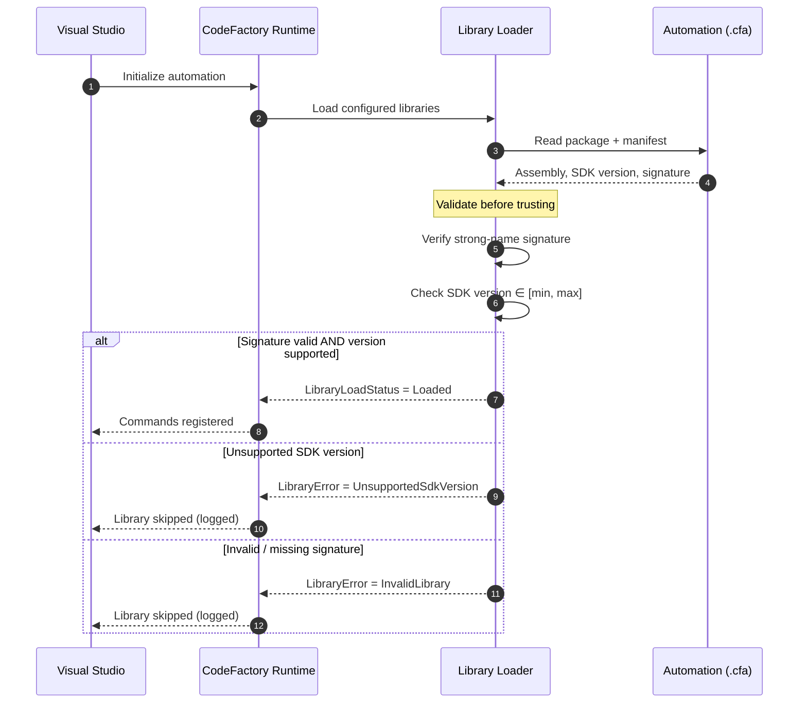

# Authentication & Validation

Unlike a web API, CodeFactory automation isn't authenticated with a token — it is
**authenticated structurally**. Before the runtime executes any of your commands,
it verifies that your `.cfa` package is *trusted to run* in the host: the assembly
is strong-name signed, and the SDK it was compiled against is within the runtime's
**supported version window**. This page documents that handshake and is the
reference example for guides that include a **Mermaid diagram**.

## The load-time handshake

When Visual Studio starts (or you reload automation), the **Loader** subsystem
reads each `.cfa`, validates it, and only then registers its commands.



## Why version alignment matters

The SDK stamps each compiled automation assembly with the SDK version it was
built against. The runtime declares a **minimum** and **maximum** SDK version it
can host. If your library falls outside that window, it is rejected — this is why
**recompiling after an SDK upgrade is mandatory**.

| Runtime supports | Your library built against | Result |
|---|---|---|
| `2.24224.0.1` – `2.26151.0.1` | `2.26151.0.1` | ✅ Loaded |
| `2.24224.0.1` – `2.26151.0.1` | `2.23160.0.1` | ⚠️ Below minimum → skipped |
| `2.24224.0.1` – `2.26151.0.1` | `2.27000.0.1` | ⚠️ Above maximum → skipped |

:::warning Recompile required
After updating the `CodeFactory.WinVs.SDK` package, **recompile every automation
project** and ensure the installed runtime version is **≥** your SDK version.
Otherwise the load handshake fails and your commands silently won't appear.
:::

## Inspecting load status

The loader records the outcome for every library, so you can diagnose a command
that didn't appear. Statuses surface through the load-status model:

```csharp title="Reading load results"
foreach (var library in loadStatus.Libraries)
{
    if (library.HasErrors)
    {
        _logger.Warning(
            "Automation '{Library}' was not loaded: {Error}",
            library.Name,
            library.ErrorType);
    }
}
```

:::tip Convention
Every guide that describes a process should pair a **Mermaid diagram** of the
flow with a **table** of the concrete outcomes — diagram for the shape, table for
the rules.
:::

## Related

- [Installation & Your First Command](/docs/getting-started/installation)
- [Error Handling](/docs/guides/error-handling)
